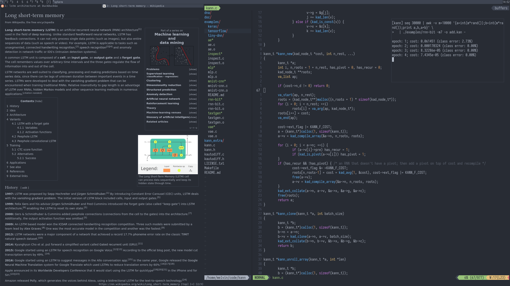
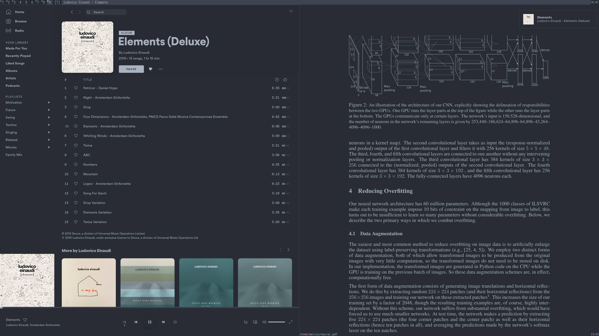

# .files
These are my personal dotfiles of my main PC and all my other devices. You probably shouldn't use these, as the configs are **very** specific to my PC usage.

## Features
* System-wide dark color scheme (e.g. Vim, DWM, ST, qutebrowser, Spotify, notifications, ...)
* System-wide Vim-key navigation
* Automatic environment setup on boot (personal preference)
* Simple and effecient backup and sync scripts
* Scripts for faster bootstrapping of projects and better development experience

## Screenshots
qutebrowser and Neovim

Spotify and Zathura

## My routine for new machines
1. Clone this repository and move all its files into your `$HOME` (including `.git`)
2. Execute `./sync`
3. Repeat step 2 every once in a while
